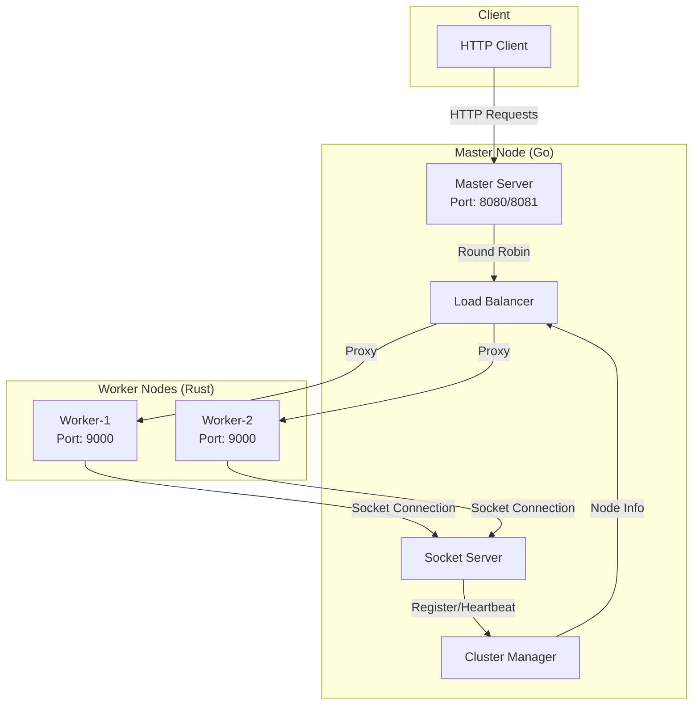

# Web Server Cluster

Распределенная система веб-серверов с центральным сервером на Go и рабочими нодами на Rust.

## Архитектура



## Технологии

- **Go** - Центральный сервер (порты 8080/8081)
- **Rust** - Рабочие ноды (порт 9000)
- **Docker** - Контейнеризация
- **TCP Sockets** - Связь между компонентами

## Быстрый старт

```bash
docker-compose up --build -d
docker-compose run --rm test-client
```

## API Endpoints

### Master (8080)
- `GET /api/cluster/status` - Статус кластера
- `GET /api/cluster/nodes` - Список нод
- `GET /api/balancer/status` - Статус балансировщика
- `GET /` - Прокси к нодам

### Workers (9000)
- `GET /api/health` - Health check
- `GET /api/info` - Информация о ноде
- `GET /api/status` - Статус ноды
- `GET /` - Основная страница

## Структура проекта

```
web-srv/
├── master/                 # Центральный сервер (Go)
├── worker/                 # Рабочие ноды (Rust)
├── tests/                  # Тесты (Go)
├── docker-compose.yml     # Docker Compose
└── README.md             # Документация
```

## Тестирование

```bash
docker-compose run --rm test-client
```

## Лицензия

MIT License 